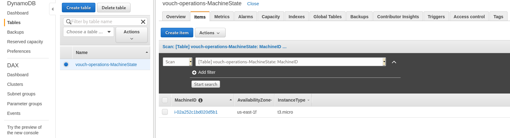

# Vouch Operations Assessment

This repository contains the code and instructions for an assessment used during the 
interviewing process for operations roles at Vouch.

## Description

This system consists of an EC2 node which writes a document to AWS DynamoDB containing some information
about the instance created by AWS. Terraform is used to provision the infrastructure.

## Assignment

Your assignment consists of the following tasks:
1. Setup an AWS Account.
1. Deploy the infrastructure with Terraform. All the resources defined in this repository can run in the [AWS Free Tier](https://aws.amazon.com/free/).
1. Find the bug in the terraform code, create a git patch and send it to the recruiter you're in contact with. Do not create a pull request.

### Documentation

#### Prerequisites and dependencies
- Terraform 0.14
- git
- ssh

#### Mechanism

The EC2 instance boots the latest [Amazon Linux 2](https://aws.amazon.com/amazon-linux-2/) and runs a 
[shell script](upload_machine_data.sh) through [cloud-init](https://docs.aws.amazon.com/AWSEC2/latest/UserGuide/user-data.html) 
user data.

In this shell script, the instance will retrieve instance metadata and store it in an [AWS DynamoDB](https://aws.amazon.com/dynamodb/) table.

The terraform code requires setting a variable named `public_key`. This should be the public key of the key pair for launching the instance. 
You can provide any public key for which you have access to the corresponding private key. 

### Expected results

If everything properly executes you should be able to see an item like the following in a Dynamo Table named `vouch-operations-MachineState`

.

However, there is a bug in the code that prevents the expected result to be completed. We would like you to find the bug, solve
it and create a git patch file for the proposed code changes. 

In the interest of keeping the assessment a fair challenge for each candidate, do not share your work or solution. This is the reason why we ask you to provide a git patch instead of creating a pull request.

Some guidelines:
- Do not fork the repository, only clone it.
- Work on your local git clone to create the patch. Do not push your work to a public repository.
